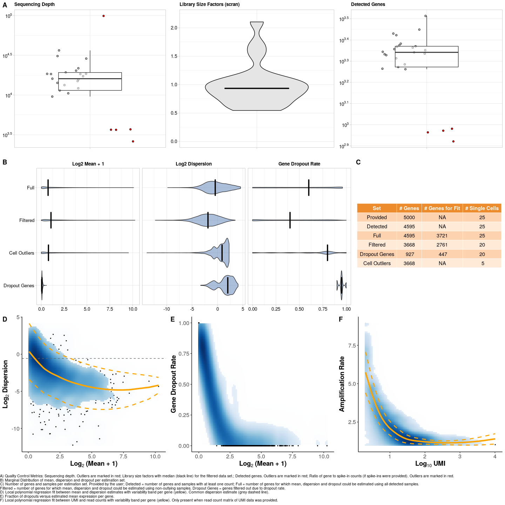
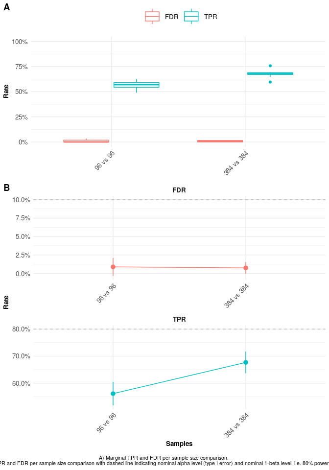

powsimR simulations
================

# Estimating parameters

The first step is the estimation of parameters needed for simulations,
both for genes and spike-ins. We will use a random subsample of 25 cells
and 5000 genes from SCRB-seq data processed with zUMIs using STAR
aligner with gencode annotation.

``` r
InputData <- readRDS(file = "SCRBseq.rds")
estparam.gene <- estimateParam(countData = InputData$GeneUMIs, 
                          readData = InputData$GeneReads, 
                          Lengths = InputData$GeneLengths,
                          RNAseq = "singlecell", Protocol = "UMI", Distribution = "NB", 
                          Normalisation = "scran", 
                          GeneFilter = 0.1, SampleFilter = 3)
```

    ## Checking countData and readData match.

    ## The provided count matrix has 25 out of 25 single cells and 4595 out of 5000 genes with at least 1 read count.

    ## 5 out of 25 single cells were determined to be outliers and removed prior to normalisation.

    ## 927 genes out of 4595 were deemed unexpressed and removed prior to normalisation.

    ## Using computeSumFactors, i.e. deconvolution over all cells!

    ## For 2761 out of 4595 genes, mean, dispersion and dropout could be estimated. 20 out of 25 single cells were used for this.

``` r
estparam.spike <- estimateSpike(spikeData = InputData$SpikeCounts, spikeInfo = InputData$SpikeInfo, 
    Normalisation = "depth")
```

``` r
plotParam(estparam.gene)
```

<!-- -->

# Set up simulations

We will define a small example setup defining differential expression
patterns and sample size
setup.

``` r
lfc.gamma.narrow.asym = function(x) sample(c(-1,1), size=x, prob = c(0.25,0.75),replace=T)*rgamma(x, shape = 1, rate = 2)
setup <- Setup(ngenes = 1000, nsims = 10, 
               p.DE = 0.1, pLFC = lfc.gamma.narrow.asym,
               n1 = c(96, 384), n2 = c(96, 384), 
               LibSize = 'equal', DropGenes = TRUE, 
               estParamRes = estparam.gene, estSpikeRes = estparam.spike)
```

    ## Seed: 988565

    ## You have chosen to simulate the expression of 1000 genes, which will be randomly drawn without replacement from the observed expression of 3668 genes.

    ## From the simulated 1000 genes, 20% will be dropouts.

# Run simulations

We run the simulations using our recommended pipeline.

``` r
simres <- simulateDE(SetupRes = setup,
                     Normalisation = "scran", Label = "clustering", 
                     DEmethod = "limma-trend")
```

    ## limma-trend is developed for bulk RNA-seq experiments.

    ## Preparing output arrays.

    ## 
    ##   SIMULATION   NUMBER   1

    ## Generating gene expression.

    ## Generating spike-in expression.

    ## 96 vs. 96

    ## Associating gene lengths with gene expression

    ## Applying scran normalisation

    ## Deconvolution within clusters.

    ## Reassociate gene lengths with gene expression

    ## Applying limma-trend for DE analysis on raw count data.

    ## Estimating moments of raw count data.

    ## 384 vs. 384

    ## Associating gene lengths with gene expression

    ## Applying scran normalisation

    ## Deconvolution within clusters.

    ## Reassociate gene lengths with gene expression

    ## Applying limma-trend for DE analysis on raw count data.

    ## Estimating moments of raw count data.

    ## 
    ##   SIMULATION   NUMBER   2

    ## Generating gene expression.

    ## Generating spike-in expression.

    ## 96 vs. 96

    ## Associating gene lengths with gene expression

    ## Applying scran normalisation

    ## Deconvolution within clusters.

    ## Reassociate gene lengths with gene expression

    ## Applying limma-trend for DE analysis on raw count data.

    ## Estimating moments of raw count data.

    ## 384 vs. 384

    ## Associating gene lengths with gene expression

    ## Applying scran normalisation

    ## Deconvolution within clusters.

    ## Reassociate gene lengths with gene expression

    ## Applying limma-trend for DE analysis on raw count data.

    ## Estimating moments of raw count data.

    ## 
    ##   SIMULATION   NUMBER   3

    ## Generating gene expression.

    ## Generating spike-in expression.

    ## 96 vs. 96

    ## Associating gene lengths with gene expression

    ## Applying scran normalisation

    ## Deconvolution within clusters.

    ## Reassociate gene lengths with gene expression

    ## Applying limma-trend for DE analysis on raw count data.

    ## Estimating moments of raw count data.

    ## 384 vs. 384

    ## Associating gene lengths with gene expression

    ## Applying scran normalisation

    ## Deconvolution within clusters.

    ## Reassociate gene lengths with gene expression

    ## Applying limma-trend for DE analysis on raw count data.

    ## Estimating moments of raw count data.

    ## 
    ##   SIMULATION   NUMBER   4

    ## Generating gene expression.

    ## Generating spike-in expression.

    ## 96 vs. 96

    ## Associating gene lengths with gene expression

    ## Applying scran normalisation

    ## Deconvolution within clusters.

    ## Reassociate gene lengths with gene expression

    ## Applying limma-trend for DE analysis on raw count data.

    ## Estimating moments of raw count data.

    ## 384 vs. 384

    ## Associating gene lengths with gene expression

    ## Applying scran normalisation

    ## Deconvolution within clusters.

    ## Reassociate gene lengths with gene expression

    ## Applying limma-trend for DE analysis on raw count data.

    ## Estimating moments of raw count data.

    ## 
    ##   SIMULATION   NUMBER   5

    ## Generating gene expression.

    ## Generating spike-in expression.

    ## 96 vs. 96

    ## Associating gene lengths with gene expression

    ## Applying scran normalisation

    ## Deconvolution within clusters.

    ## Reassociate gene lengths with gene expression

    ## Applying limma-trend for DE analysis on raw count data.

    ## Estimating moments of raw count data.

    ## 384 vs. 384

    ## Associating gene lengths with gene expression

    ## Applying scran normalisation

    ## Deconvolution within clusters.

    ## Reassociate gene lengths with gene expression

    ## Applying limma-trend for DE analysis on raw count data.

    ## Estimating moments of raw count data.

    ## 
    ##   SIMULATION   NUMBER   6

    ## Generating gene expression.

    ## Generating spike-in expression.

    ## 96 vs. 96

    ## Associating gene lengths with gene expression

    ## Applying scran normalisation

    ## Deconvolution within clusters.

    ## Reassociate gene lengths with gene expression

    ## Applying limma-trend for DE analysis on raw count data.

    ## Estimating moments of raw count data.

    ## 384 vs. 384

    ## Associating gene lengths with gene expression

    ## Applying scran normalisation

    ## Deconvolution within clusters.

    ## Reassociate gene lengths with gene expression

    ## Applying limma-trend for DE analysis on raw count data.

    ## Estimating moments of raw count data.

    ## 
    ##   SIMULATION   NUMBER   7

    ## Generating gene expression.

    ## Generating spike-in expression.

    ## 96 vs. 96

    ## Associating gene lengths with gene expression

    ## Applying scran normalisation

    ## Deconvolution within clusters.

    ## Reassociate gene lengths with gene expression

    ## Applying limma-trend for DE analysis on raw count data.

    ## Estimating moments of raw count data.

    ## 384 vs. 384

    ## Associating gene lengths with gene expression

    ## Applying scran normalisation

    ## Deconvolution within clusters.

    ## Reassociate gene lengths with gene expression

    ## Applying limma-trend for DE analysis on raw count data.

    ## Estimating moments of raw count data.

    ## 
    ##   SIMULATION   NUMBER   8

    ## Generating gene expression.

    ## Generating spike-in expression.

    ## 96 vs. 96

    ## Associating gene lengths with gene expression

    ## Applying scran normalisation

    ## Deconvolution within clusters.

    ## Reassociate gene lengths with gene expression

    ## Applying limma-trend for DE analysis on raw count data.

    ## Estimating moments of raw count data.

    ## 384 vs. 384

    ## Associating gene lengths with gene expression

    ## Applying scran normalisation

    ## Deconvolution within clusters.

    ## Reassociate gene lengths with gene expression

    ## Applying limma-trend for DE analysis on raw count data.

    ## Estimating moments of raw count data.

    ## 
    ##   SIMULATION   NUMBER   9

    ## Generating gene expression.

    ## Generating spike-in expression.

    ## 96 vs. 96

    ## Associating gene lengths with gene expression

    ## Applying scran normalisation

    ## Deconvolution within clusters.

    ## Reassociate gene lengths with gene expression

    ## Applying limma-trend for DE analysis on raw count data.

    ## Estimating moments of raw count data.

    ## 384 vs. 384

    ## Associating gene lengths with gene expression

    ## Applying scran normalisation

    ## Deconvolution within clusters.

    ## Reassociate gene lengths with gene expression

    ## Applying limma-trend for DE analysis on raw count data.

    ## Estimating moments of raw count data.

    ## 
    ##   SIMULATION   NUMBER   10

    ## Generating gene expression.

    ## Generating spike-in expression.

    ## 96 vs. 96

    ## Associating gene lengths with gene expression

    ## Applying scran normalisation

    ## Deconvolution within clusters.

    ## Reassociate gene lengths with gene expression

    ## Applying limma-trend for DE analysis on raw count data.

    ## Estimating moments of raw count data.

    ## 384 vs. 384

    ## Associating gene lengths with gene expression

    ## Applying scran normalisation

    ## Deconvolution within clusters.

    ## Reassociate gene lengths with gene expression

    ## Applying limma-trend for DE analysis on raw count data.

    ## Estimating moments of raw count data.

# Differential Expression Evaluation

``` r
eval.de <- evaluateDE(simRes = simres, alpha.type = "adjusted", MTC = "BY")
```

``` r
plotEvalDE(eval.de, rate = "marginal")
```

<!-- -->
